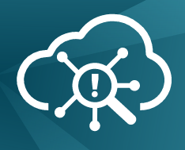

# FSIEM SAAS



This project contains source code for deploying FortiSiem to the cloud.
We have several environments where you can access FortiSiem Cloud,
for example, the [dev portal](https://fortisiem-dev.forticloud.com).

## What does this project do?

Before this project customers either purchased a physical appliance or a VM
which they hosted using _their resources_. This project allows customers
to click a button, and deploy a FortiSiem VM into the cloud that is hosted by the
FortiSiem Cloud team. Customers get a hosted solution and don't need to care about
software or hardware failures. FortiSiem Cloud team maintains all the VMs in the cloud.

## Development

Consider using [Ubuntu](https://ubuntu.com/) or MAC OSX for development.
On the MAC, use the _latest version_ of bash, as we require v5.X for a build.
The [code owners file](.gitlab/CODEOWNERS) documents the people responsible
for the repository. [VS Code](https://code.visualstudio.com/) is suggested for
development. VS Code has a range of useful extensions, which you can customise
in the [extensions.json](.vscode/extensions.json) file.

To checkout the code, follow the usual git process. Please note, there's
additional security enforcement of 2FA, you will be asked to periodically provide
a 2FA token. If you use a GUI git client, you may need to run the 2FA command in
the command line, to get your GUI client to play ball.

### First time cloning a repo

```bash
# Add your SSH public key to the new server:
# https://dops-git106.fortinet-us.com/-/profile/keys/
# ssh-keygen -t ed25519 -C "your-email@fortinet.com"
# cat ~/.ssh/id_ed25519.pub
cd ~/git
ssh git@dops-git106.fortinet-us.com 2fa_verify
git clone git@dops-git106.fortinet-us.com:fsiem/fsiem_cloud.git
cd fsiem_cloud
```

### Prerequisites and config

Run the bootstrap script to install build dependencies and configure your AWS access key:

```bash
# Note you need to run this as sudo, ultimately because docker needs sudo,
# and hence other things need sudo too, e.g. sudo aws configure
sudo ./build/bootstrap.sh
sudo aws configure
```

## Main build targets

Build runs via docker-compose. You can customise which environment to use for
build and deployment and what version you are building. Parameter customisation
is done via environmental variables, see [build/set_env.sh](build/set_env.sh)
for a full list of vars you can customise. If you don't export any env vars, the
build will assume a local build and playground deployment environment.

```bash
# All env variables are optional
export CI_ENVIRONMENT_NAME=playground # dev/playground/staging/prod
export VERSION_MAJOR=22
export VERSION_MINOR=1

# From the root of the project
# cd ~/git/fsiem_cloud

# Build what you have
sudo -E bash build/ci-wrapper.sh build

# Deploy this build to env defined by $CI_ENVIRONMENT_NAME
sudo -E bash build/ci-wrapper.sh deploy

# Update project dependencies, libraries and tools
sudo -E bash build/ci-wrapper.sh update

# Format source code using automated linters and formatters
sudo -E bash build/ci-wrapper.sh format
```

If you switch between environments, it's a good habit to update the `CI_ENVIRONMENT_NAME`
env variable, then run `build`, then run `deploy`.

## Documentation location

Documentation is stored in the [wiki](https://dops-git106.fortinet-us.com/fsiem/fsiem_cloud/-/wikis/home).

## Environments

The following environments are in use:

| Name            | AWS region | AWS Account                         | AWS login  |
|-----------------|------------|-------------------------------------|------------|
| [dev][1]        | us-east-1  | `ldap`@fortinet-us.com 023941436530 | [login][4] |
| [playground][2] | us-east-1  | `ldap`@fortinet-us.com 023941436530 | [login][4] |
| [prod][3]       | us-east-1  | `ldap`@fortinet-us.com 327332988639 | [login][5] |

[1]: https://fortisiem-dev.forticloud.com
[2]: https://fortisiem-playground.forticloud.com
[3]: https://fortisiem.forticloud.com
[4]: https://console.aws.amazon.com
[5]: https://aws.corp.fortinet.com/

## Security

If you found a security-related issue, please disclose it privately to [PSIRT](https://www.fortiguard.com/faq/psirt-contact).

## FAQ

**Q:** How do I start? <br/>
**A:** Browse docs in `Teams > FSIEM Cloud Team`, and check the
       [wiki](https://dops-git106.fortinet-us.com/fsiem/fsiem_cloud/-/wikis/home).
       Ask your teammates for an overview meeting. Feel free to improve docs
       yourself, found something that isn't documented but useful - add it?

**Q:** How do I ssh to a super/worker? <br/>
**A:** For EC2 instances, we use
       [system manager](https://us-east-1.console.aws.amazon.com/systems-manager/home?),
       for EKS - see [doc/TROUBLESHOOTING.md](doc/TROUBLESHOOTING.md).

**Q:** What about code reviews? <br/>
**A:** Got them, discussed in [doc/CODE_REVIEW.md](doc/CODE_REVIEW.md).

**Q:** Any guides for terraform or terragrunt? <br/>
**A:** Yep, see [doc/HASHICORP.md](doc/HASHICORP.md).

**Q:** What is the main tech stack? <br/>
**A:** C# dotnet core (API), Angular (UI), terraform (infrastructure as a code),
       terragrunt (deploy multiple environments), docker and docker-compose (build),
       AWS (hosts deployments and VM), some python and bash (scripting).

**Q:** How do I contribute? <br/>
**A:** Create a [Mantis ticket](https://mantis.fortinet.com), make a feature branch
       `git checkout -b feature/foo`. Make a change and push `git push`. Raise a [merge
       request](https://dops-git106.fortinet-us.com/fsiem/fsiem_winagent/-/merge_requests).
       Get the build and test passing, and address any code review feedback. Finally,
       trigger a merge train, which will build-test-plan-deploy your changes to dev env.

**Q:** How do I change gitlab env variable, like `AWS_ACCESS_KEY_ID`? <br/>
**A:** Default variables are configured in [Gitlab > Settings > CI/CD](https://dops-git106.fortinet-us.com/fsiem/fsiem_cloud/-/settings/ci_cd),
       click the `Variables` button.

**Q:** How do I bash into a container? <br/>
**A:** You can use these one-liners:

```bash
# Full build container
sudo docker run -it --rm --entrypoint /bin/bash fsiem-saas-build

# API
sudo docker run -it --rm --entrypoint bash portal_api_build

# UI
sudo docker run -it --rm --entrypoint sh portal_ui_build
```
